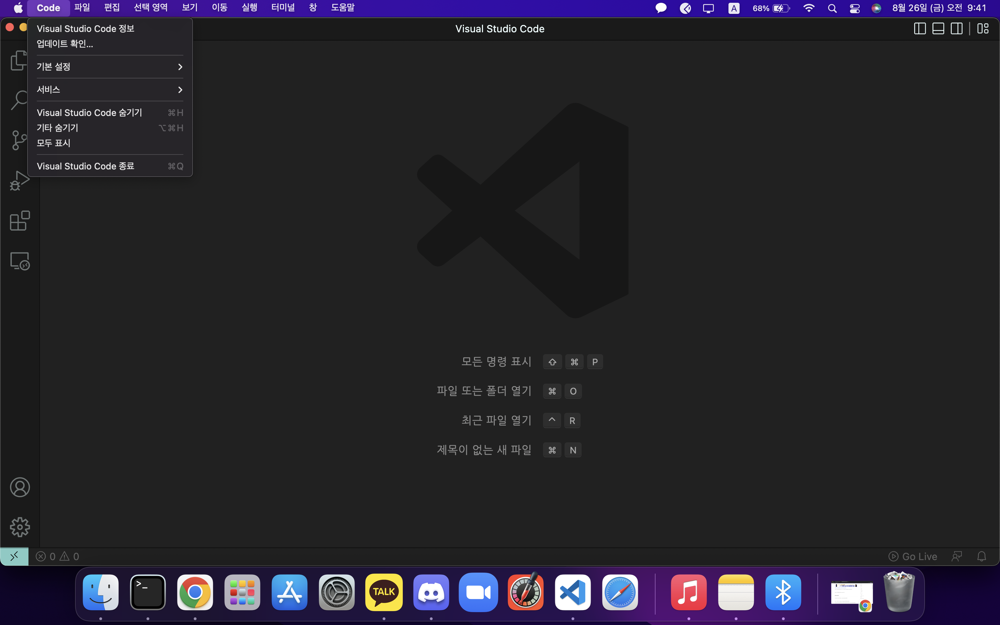
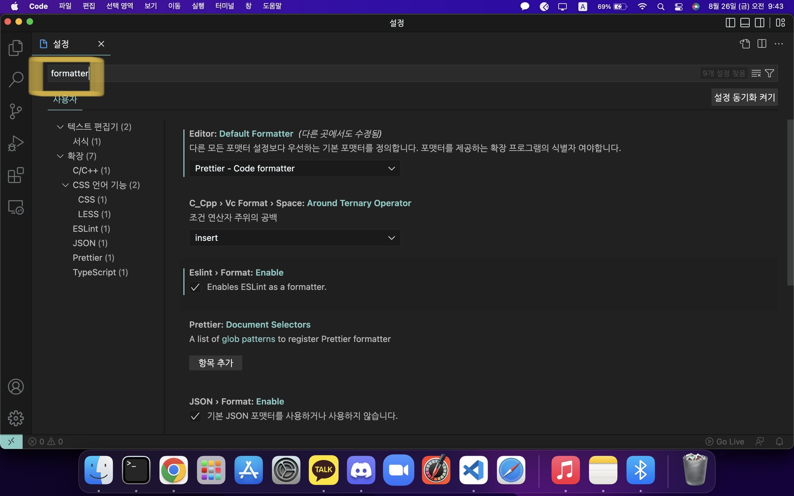
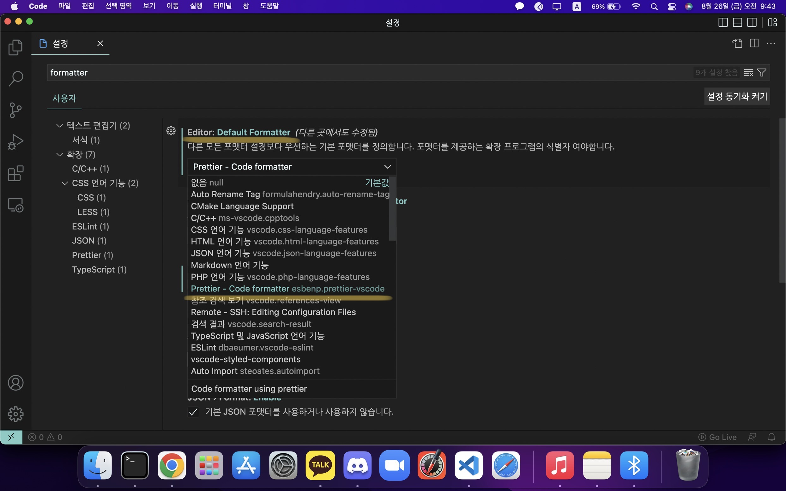
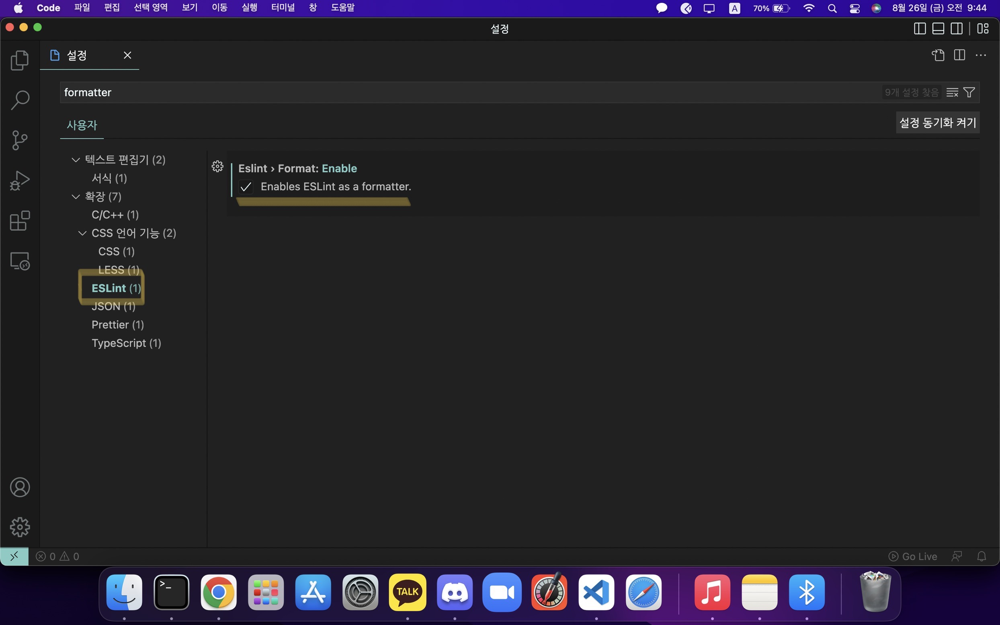
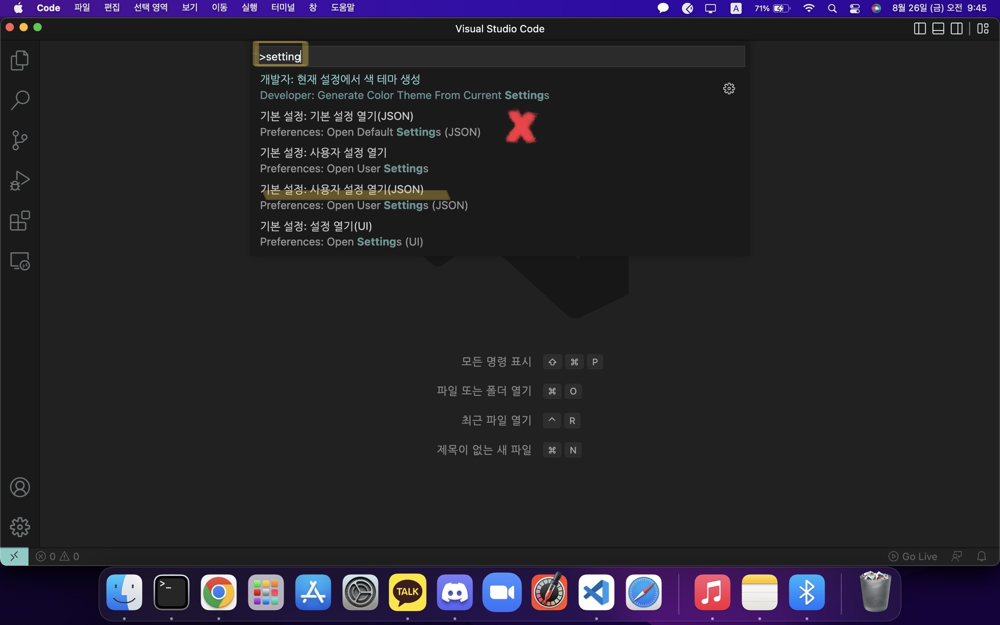
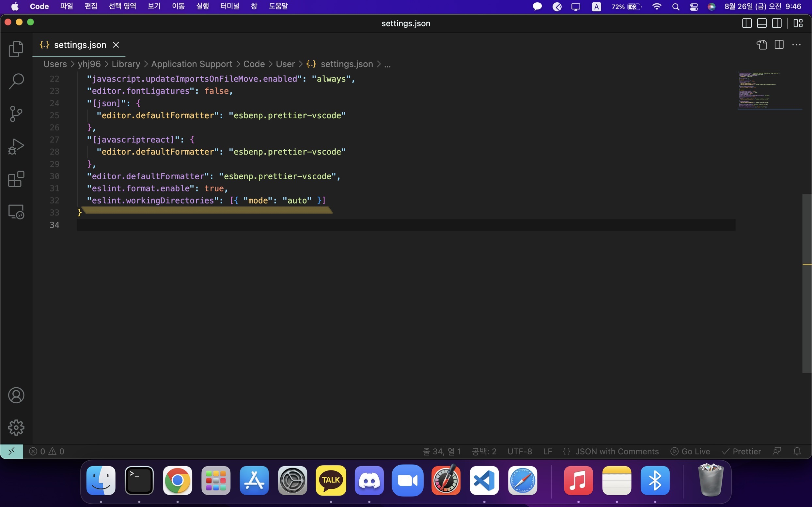

# ESLint & Prettier Visual Code 설정 방법

### 1. 비주얼 코드에 들어온 뒤 Code 버튼을 클릭한다.

<p align="center">
  
</p>

<br>

<div style="page-break-after: always;"></div>

### 2. Code의 기본 설정을 들어간뒤 설정을 들어간다.

<p align="center">
  
</p>

### 3. 입력창에 `formatter`를 입력한다.

<p align="center">
  
</p>

<div style="page-break-after: always;"></div>

### 4. `Default Formatter` 설정을 `Prettier`로 설정한다.

<p align="center">
  
</p>

### 5. 왼쪽의 메뉴바에서 ESLint를 클릭한 뒤 Format의 체크박스를 클릭하여 활성화 시켜준다.

<p align="center">
  
</p>

<div style="page-break-after: always;"></div>

### 6. 입력창에 `format on save`를 입력한 뒤 해당 기능을 활성화 시켜준다.

<p align="center">
  
</p>

### 7. 보기의 명령 팔레트를 클릭한다.

<p align="center">
  
</p>

<div style="page-break-after: always;"></div>

### 8. 입력창에 `setting`을 입력한 뒤 `Open User Settings`를 클릭한다.

❗️ `Open Default Settings`가 아닌지 확인하세요!!

<p align="center">
  
</p>

### 9. JSON 파일안에 하단의 코드를 넣어준 뒤 설정을 완료합니다.

<p align="center">
  
</p>

```json
"eslint.workingDirectories": [{ "mode": "auto" }]
```
