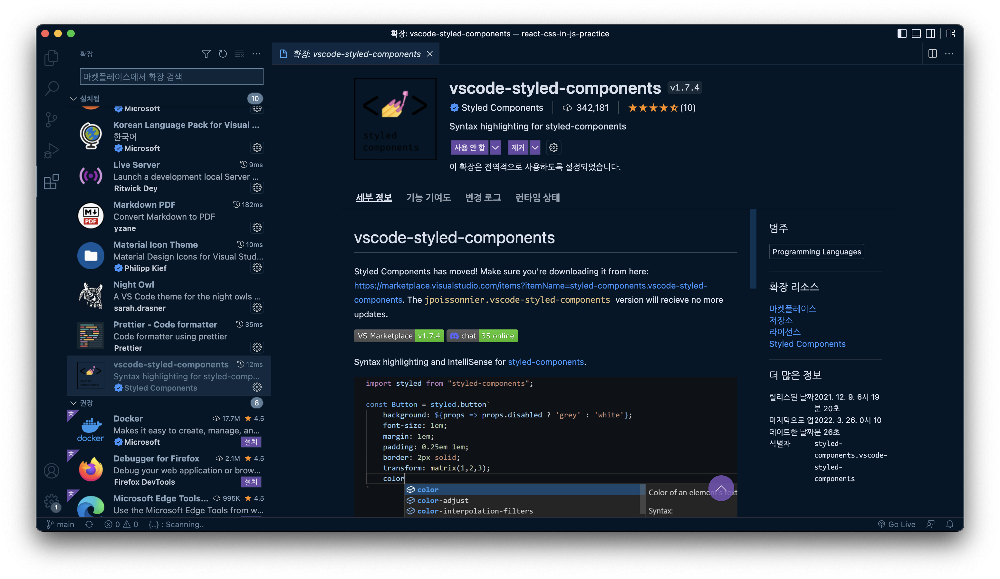
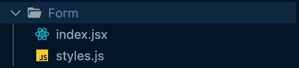
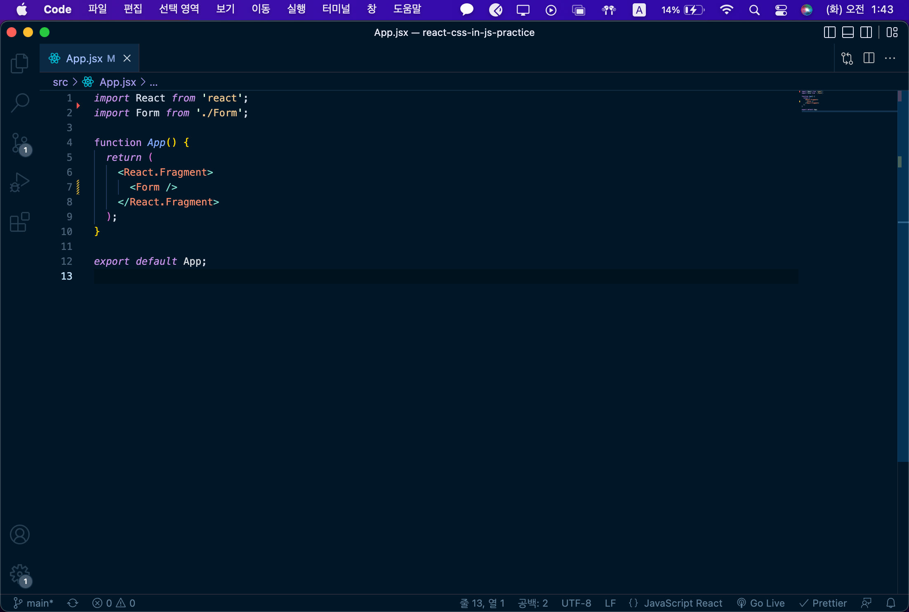

# 스타일 컴포넌트 사용법

## 코드 링크

[예제 레파지토리](https://github.com/YHJ96/react-css-in-js-practice.git)

## 스타일 컴포넌트 익스텐션 설치

- 문자열에서 작업하는 동안 CSS 자동완성 기능을 제공한다.
- 구문 오류를 알려준다.

<p>
  
</p>

## 스타일 컴포넌트 사용목적

- class 작명을 신경쓰지 않아도 된다.
- hover, before 등 선택자를 한 스코프안에서 선언이 가능하다.
- 원하는 스타일을 상속받아 재사용이 가능하다.
- Props을 이용해서 컴포넌트를 재사용이 가능하다.

<div style="page-break-after: always;"></div>

# 스타일 컴포넌트 사용방법 (프로젝트에서 주로 사용하는 문법)

## 기본 사용법

- styled-components 모듈을 import 하여 사용한다.
- 해당 태그를 선택하고 템플릿 리터럴 형식을 붙혀준다.
- 변수의 작명은 파스칼 표기법을 사용한다.
- 가상 선택자를 지정할 때 해당 컴포넌트는 `&` 형식으로 불러온다.

### 스타일 컴포넌트

```javascript
import styled, { keyframes } from "styled-components";

const BasicButton = styled.button`
  border: 2px solid green;
  background-color: green;
  color: white;
  padding: 16px;
  text-align: center;
  font-size: 16px;
  cursor: pointer;

  /* 스코프 안에서 설정 가능하다. */
  &:hover {
    background-color: white;
    border: 2px solid green;
    color: green;
  }
`;

function StyledComponent() {
  return (
    <div>
      <BasicButton>기본 버튼</BasicButton>
    </div>
  );
}

export default StyledComponent;
```

<div style="page-break-after: always;"></div>

### Common CSS

```javascript
/* CommonCSS.js */
import React from "react";
import "./styles.css";

function CommonCSS() {
  return (
    <div>
      <button className="basic-button">기본 버튼</button>
    </div>
  );
}

export default CommonCSS;
```

```css
/* styles.css */
.basic-button {
  border: 2px solid green;
  background-color: green;
  color: white;
  padding: 16px;
  text-align: center;
  font-size: 16px;
  cursor: pointer;
}

.basic-button:hover {
  background-color: white;
  border: 2px solid green;
  color: green;
}
```

- 스타일 컴포넌트는 같은 스코프안에 작성할 수 있기 때문에 가독성이 올라간다.
- class의 중복 작명을 걱정하지 않아도 된다.

<div style="page-break-after: always;"></div>

## props 사용법

- 템플릿 리터럴의 플레이스 홀더 안에 함수를 넣어준다.
- 함수의 첫 번째 요소는 해당 컴포넌트의 props의 객체이며 `return` 값이 해당 CSS의 값이 된다.
- default 설정도 가능하다.
- 스타일 컴포넌트 모듈에서 css 프로퍼티를 사용하면 한번에 여러개의 CSS를 정의할 수 있다.

### 스타일 컴포넌트

```javascript
import React from "react";
import styled, { css } from "styled-components";

const PropsButton = styled.button`
  border: 2px solid ${(props) => props.color};
  background-color: ${(props) => props.color};
  color: white;
  padding: 16px;
  text-align: center;
  font-size: 16px;
  cursor: pointer;

  /* 없는 설정이면 추가하고 있는 설정이면 아래의 CSS가 우선순위가 된다. */
  ${(props) =>
    props.color === "primary" &&
    css`
      color: white;
      background: navy;
      border-color: navy;
    `}
`;

// defaultProps도 설정 가능하다.
PropsButton.defaultProps = {
  color: "blue",
};

function StyledComponent() {
  return (
    <div>
      /* PropsButton의 color가 props.color로 설정된다. */
      <PropsButton color="red">Props 버튼</PropsButton>
      <PropsButton color="purple">Props 버튼</PropsButton>
      <PropsButton color="primary">Props 버튼</PropsButton>
    </div>
  );
}

export default StyledComponent;
```

<div style="page-break-after: always;"></div>

### Common CSS in React

```javascript
import React from "react";

// PropsButton 컴포넌트 생성
function PropsButton(props) {
  const styles = {
    // 리액트에서는 객체로 사용하기 때문에 작명이 카멜 케이스로 바뀐다.
    border: `2px solid ${props.color}`,
    backgroundColor: props.color,
    color: "white",
    padding: "16px",
    textAlign: "center",
    fontSize: "16px",
    cursor: "pointer",
  };
  return <button style={styles}>{props.children}</button>;
}

PropsButton.defaultProps = {
  color: "blue",
};

function CommonCSS() {
  return (
    <div>
      <PropsButton color="red">Props 버튼</PropsButton>
      <PropsButton color="purple">Props 버튼</PropsButton>
    </div>
  );
}

export default CommonCSS;
```

- react에서 props를 직접받아서 사용할 수 있으나 객체로 지정해야 한다.
- 기본 CSS 속성의 작명이 카멜 케이스로 바뀌기 때문에 스타일 컴포넌트로 더욱더 CSS 처럼 사용할 수 있다.
- 스타일 컴포넌트는 컴포넌트를 생성해주기 때문에 컴포넌트를 따로 지정하여 만들 필요없다.

<div style="page-break-after: always;"></div>

## extend 사용법 (CSS를 상속받아서 사용하기)

- styled를 참조하여 사용하지 않고 호출하여 사용한다.
- 파라미터로 상속 받고 싶은 스타일 컴포넌트를 파라미터로 넣어준다.

### 스타일 컴포넌트

```javascript
import React from "react";
import styled from "styled-components";

const BasicButton = styled.button`
  border: 2px solid green;
  background-color: green;
  color: white;
  padding: 16px;
  text-align: center;
  font-size: 16px;
  cursor: pointer;
`;

const ExtendButton = styled(BasicButton)`
  font-size: 20px;
`;

function StyledComponent() {
  return (
    <div>
      <ExtendButton>Extend 버튼</ExtendButton>
    </div>
  );
}

export default StyledComponent;
```

<div style="page-break-after: always;"></div>

### Common CSS in React

```javascript
import React from "react";

function ExtendButton(props) {
  const extendStlye = {
    ...props.styles,
    fontSize: "20px",
  };
  return <button style={extendStlye}>{props.children}</button>;
}

function CommonCSS() {
  const styles = {
    border: `2px solid blue`,
    backgroundColor: "blue",
    color: "white",
    padding: "16px",
    textAlign: "center",
    fontSize: "16px",
    cursor: "pointer",
  };
  return (
    <div>
      <ExtendButton styles={styles}>Extend 버튼</ExtendButton>
    </div>
  );
}

export default CommonCSS;
```

- 리액트에서 CSS를 상속받기 위해서는 객체를 props로 넘겨줘야 한다.
- 스타일 컴포넌트를 사용하면 가독성이 좋으며 코드가 명확해진다.

<div style="page-break-after: always;"></div>

# 프로젝트에서 주로 사용하지 않지만 알아두면 좋은 문법

## attrs 사용법

- 컴포넌트를 지정하고 난뒤 attrs 메소드를 호출한다.
- attrs 메소드를 호출하고 난 뒤에 리터럴 문자열을 사용한다.
- 해당 html 태그의 속성을 지정할 수 있다.
- 공식문서에서는 속성을 지정할 수 있지만 특수한 경우에만 사용하고 지양하고 있는 옵션인것 같다.
- props를 받아서 사용할 수도 있다.

```javascript
// 공식문서 예시 (props로 지정)
/* 이와 같이 패스워드만 나타내는 input일 경우 속성 타입을 명시해준다. */
const PasswordInput = styled.input.attrs((props) => ({
  type: "password",
}))`CSS`;
```

```javascript
// attrs 메소드에 객체를 파라미터로 넘겨줘도 된다.
const AttributeButton = styled.button.attrs({
  type: "submit",
})`
  background-color: red;
`;
```

```javascript
// CSS를 상속받아서도 사용 가능하다.
const AttributeButton = styled(ExtendComponet).attrs({
  type: "submit",
})`
  background-color: red;
`;
```

<div style="page-break-after: always;"></div>

## 애니메이션 사용법

- 스타일 컴포넌트 모듈에서 `keyframes` 프로퍼티를 호출한다.
- `keyframes`는 항상 animation을 사용할 컴포넌트 위에 선언해야 한다.
- animation CSS 타입에 keyframes을 할당한 변수를 플레이스 홀더에 넣어준다.

```javascript
import React from "react";
// 모듈의 keyframes 프로퍼티 호출하기
import styled, { keyframes } from "styled-components";

const rotate = keyframes` 
  from {
    transform: rotate(0deg);
  } to {
    transform: rotate(360deg);
  }
`;

const AnimatedDiv = styled.div`
  width: 100px;
  height: 100px;
  background-color: gold;
  animation: ${rotate} infinite 10s;
`;

function StyledComponent() {
  return (
    <div>
      <AnimatedDiv />
    </div>
  );
}

export default StyledComponent;
```

<div style="page-break-after: always;"></div>

# 프로젝트에서 CSS 로직을 분리해서 사용하기

**컴포넌트 예시**

- 컴포넌트 명으로 폴더를 생성한다.
- index.jsx or index.js 파일을 생성한다. (프로젝트 컨벤션은 js)
- styles.js 파일을 생성한다.
- index 파일에는 컴포넌트의 이벤트 함수등을 정의해서 사용한다.
- styles 파일에는 스타일 컴포넌트로 만든 즉 CSS 컴포넌트를 생성한다.

<p align="center">
  
</p>

## index.js

- 만든 컴포넌트들을 import해서 사용한다.
- CSS 컴포넌트와 이벤트 함수 등 기능을 담당하는 함수와 분리해서 사용한다.

```javascript
import React from "react";
// CSS 컴포넌트
import {
  Container,
  Title,
  InputWrapper,
  Input,
  ButtonWrapper,
  Button,
} from "./styles";

function Form() {
  // 이벤트 함수
  const handleOnSubmit = (e) => {
    e.preventDefault();
    const { id, pw } = e.target;
    console.group();
    console.log("id:", id.value);
    console.log("pw:", pw.value);
    console.groupEnd();
    e.target.reset();
  };

  return (
    /* CSS 컴포넌트를 불러와서 사용한다. */
    <Container onSubmit={handleOnSubmit}>
      <Title>회원가입</Title>
      <InputWrapper>
        <Input name="id" type="text" placeholder="ID를 입력하세요." />
        <Input name="pw" type="password" placeholder="PW를 입력하세요." />
      </InputWrapper>
      <ButtonWrapper>
        <Button type="submit">확인</Button>
        <Button>취소</Button>
      </ButtonWrapper>
    </Container>
  );
}

export default Form;
```

<div style="page-break-after: always;"></div>

## styles.js

- 스타일 컴포넌트를 이용해서 만든 컴포넌트들을 관리한다.
- 모듈의 요소를 내보내는 `export`를 이용해서 요소들을 내보낸다.

```javascript
import styled from "styled-components";
// CSS 컴포넌트
const Container = styled.form`
  margin-top: 32px;
  display: flex;
  flex-direction: column;
  justify-content: center;
  align-items: center;
  border: 1px solid #bdbdbd;
  border-radius: 2px;
  padding: 10px 0px;
`;

const Title = styled.h2`
  font-family: inherit;
  font-size: 32px;
`;

const InputWrapper = styled.div`
  display: flex;
  flex-direction: column;
  width: 100%;
`;

const Input = styled.input`
  margin: 2px 32px;
  padding: 16px;
`;
const ButtonWrapper = styled.div`
  display: flex;
  width: 100%;
  justify-content: end;
  margin: 0px 32px 0px 0px;
  padding: 16px;
`;
const Button = styled.button`
  padding: 4px 12px;
  margin: 2px;
  border: none;
  border: 1px solid #bdbdbd;
  border-radius: 2px;
  cursor: pointer;

  &:hover {
    border: 1px solid #010101;
  }
`;
// 모듈의 요소를 내보내서 사용한다.
export { Container, Title, InputWrapper, Input, ButtonWrapper, Button };
```

## index.js로 파일명을 지정하는 이유

- 폴더의 경로만 불러와도 index.js가 자동으로 불러와진다.
- 폴더의 경로까지만 사용함으로 경로의 길이가 줄어든다.

<p>
  
</p>
